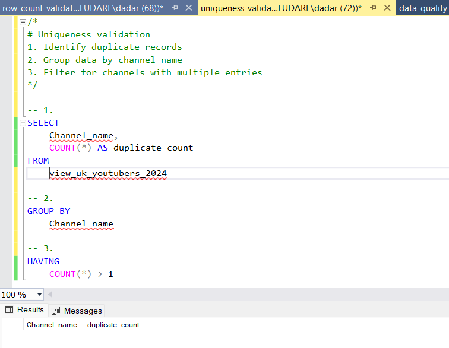

# Top UK Youtubers 2024 Dashboard

## Table of Contents
- [Objective](#objective)
- [Data Source](#data-source)
- [Phases](#phases)
- [Design](#design)
  - [Dashboard Questions](#dashboard-questions)
  - [Dashboard Components/Mockup](#dashboard-componentsmockup)
  - [Tools](#tools)
- [Development](#development)
  - [Data Analysis Pipeline](#data-analysis-pipeline)
  - [Initial Data Observations](#initial-data-observations)
  - [Data Cleaning](#data-cleaning)
  - [Apply Data Transformation](#apply-data-transformation)
  - [SQL View Creation](#sql-view-creation)
- [Data Quality Assurance](#data-quality-assurance)
  - [Data Quality Checks](#data-quality-checks)
- [Visualisation](#visualisation)
  - [Dashboard](#dashboard)
  - [DAX Measures](#dax-measures)
- [Analysis](#analysis)
  - [Key Insights](#key-insights)
  - [Validation](#validation)
  - [Key Observation](#key-observation)
- [Recommendations](#recommendations)

## Objective
Identify Top UK YouTubers for Effective Marketing Campaigns in 2024.

### The Challenge
The Head of Marketing needs a data-driven approach to identify the most impactful UK YouTubers for their 2024 marketing campaigns. These collaborations will be crucial for reaching the right audience and maximizing campaign impact.

### The Solution
By using publicly available data (including YouTube Data API and Kaggle datasets) a dashboard focusing on UK YouTubers in 2024 can be created. This dashboard will display crucial metrics like:
- **Subscriber Count**: Shows the established audience base of each YouTuber.
- **Total Views**: Indicates the overall content reach and potential viewership for marketing campaigns.
- **Total Videos**: Provides context on content creation frequency and potential campaign integration opportunities.
- **Engagement Metrics**: Goes beyond basic viewership and delves into audience interaction, a crucial factor for successful campaigns.
- **Target Audience**: Identify YouTubers whose audience aligns with target demographic maximizing campaign effectiveness.
- **Channel Category**: Identify YouTubers who align with your brand's style and target audience.

### The Benefit
This data-driven approach will equip the marketing team to make strategic decisions about which YouTubers best align with their campaign goals ensuring successful collaborations and maximizing return on investment.

## User Story
As the Head of Marketing, I want a data-driven approach to identify high-performing UK YouTubers. This includes analyzing subscriber count, video uploads, total views, and engagement rate. By understanding these metrics, I can make informed decisions about potential marketing partnerships that will maximize campaign return on investment (ROI).

## Data Source
To identify high-performing UK YouTubers for our 2024 marketing campaigns, we'll use a dataset containing key performance indicators (KPIs).

### Data Acquisition
- Kaggle ([Excel file](https://www.kaggle.com/datasets/bhavyadhingra00020/top-100-social-media-influencers-2024-countrywise?resource=download))
- Scrape YouTube data (Python script)
- Researched data

### Data Elements
- Channel Name
- Subscriber Count
- Total Views
- Total Videos Uploaded
- Engagement Metrics
- Channel Category
- Target Audience

## Phases
1. Design
2. Development & Implementation
3. Quality Assurance
4. Analysis

## Design

### Dashboard Questions
The following questions will guide the dashboard's content:
- **Top Performers**: 
  - Who are the top 10 YouTubers with the most subscribers?
  - Which 3 channels have uploaded the most videos?
  - Which 3 channels have the most total views?
  - Which 3 channels have the highest engagement rate?
- **Engagement & Efficiency**: 
  - Which 3 channels have the highest average views per video?
  - Which 3 channels have the highest views per subscriber ratio?
- **Additional Questions**: 
  - Is there a specific target audience demographic for the marketing campaigns?
  - What content do these YouTubers typically create (e.g., gaming, comedy, news)?

### Dashboard Components/Mockup
The dashboard will consist of several visual elements to answer the questions listed above:
- **Top Performers Section**: 
  - **Table**: Display all the YouTubers with their respective subscriber counts, video uploads, total views, likes, comments, and channel category.
  - **Horizontal Bar Chart**: Visually represent the top 10 YouTubers and their subscriber counts, total views, likes, and comments.
- **Engagement & Efficiency Section**: 
  - **Scorecards**: Showcase key metrics like average views per video, views per subscriber ratio, likes per view, and comments per view for the channels.
- **Additional Considerations**:
  - **Filtering Options**: Allow users to filter data by target audience to enhance exploration.
  - **Visual Appeal**: Maintain a clean and consistent design aesthetic to keep the dashboard visually appealing and user-friendly.


### Tools
The project will likely utilize a combination of the following tools:
- **Excel**: Initial data exploration and evaluation of the channels for product placement.
- **SQL Server**: For data cleaning, data quality tests, and analysis.
- **Power BI**: Primary tool for creating interactive visualizations and the final dashboard.
- **GitHub**: Hosting project documentation, code, and version control.
- **Mokkup AI**: Designing a wireframe/mockup for the dashboard layout.

## Development
### Data Analysis Pipeline
**Input**: Raw data

**Output**: Data visualisation and insights report

**Steps**:
1. Download the data from Kaggle.
2. Perform initial data exploration to understand its structure.
3. Import data into SQL Server.
4. Clean and transform the data using SQL queries in SQL Server to make sure it is accurate and complete. This may involve casting data types and addressing inconsistencies.
5. Test the cleaned data to ensure accuracy and completeness.
6. Import the cleaned data into Power BI for visualisation.
7. Create DAX measures to calculate additional metrics relevant for analysis.
8. Build interactive data visualisations within Power BI to create an informative dashboard.
9. Analyse the data to identify key insights.
10. Provide recommendations for potential YouTube channels to partner with.

### Initial Data Observations
The initial exploration in Excel reveals several key observations:
- **Data Completeness**: The data looks to have enough columns (at least 9) for our analysis, reducing the need for further information from the client.
- **Channel Identification**: The first column includes channel IDs separated by a "@" sign. We'll need to extract the channel names from this data.
- **Multilingual Considerations**: Some cells and headers are in another language. Identifying their relevance and resolving any language barriers will be crucial.
- **Data Streamlining**: The data includes more information than this project requires. We will need to identify and remove unnecessary columns to improve the analysis.

### Data Cleaning
Here's how the raw data will be transformed into a well-structured format:

#### Desired Outcome
- **Column Selection**: Only the key columns necessary for the analysis will be kept.
- **Data Type Validation**: Each column's data type will appropriately reflect its content (VARCHAR for channel names, INTEGER for numerical values).
- **Null Value Elimination**: There will be no null values, ensuring that each record contains complete data.
- **Channel Name Extraction**: The actual channel names will be extracted from the first column using string manipulation functions in SQL.
- **Column Renaming**: For clarity, aliases will be assigned to the columns using appropriate names.

### Final Cleaned Data Schema
- **Number of Rows**: 100 
- **Number of Columns**: 9

| Column Name       | Data Type | Nullable | Description                                      |
|-------------------|-----------|----------|--------------------------------------------------|
| channel_name      | VARCHAR   | NO       | Name of the YouTube channel                      |
| total_subscribers | INTEGER   | NO       | Total number of subscribers for the channel      |
| total_views       | INTEGER   | NO       | Total views accumulated by the channel           |
| total_videos      | INTEGER   | NO       | Total number of videos uploaded by the channel   |
| total_likes       | INTEGER   | NO       | Total number of likes generated by the channel   |
| total_comments    | INTEGER   | NO       | Total number of comments generated by the channel|
| channel_category  | VARCHAR   | NO       | The category the channel falls under             |
| target_audience   | VARCHAR   | NO       | The demography of the channel’s audience         |

### Apply Data Transformation

```sql
/*
# DATA PREP STEPS
1. Clean up the Data: remove irrelevant columns by only keeping the ones needed.
2. Grab the Channel Names: extract channel name from 'NOMBRE' column.
*/

SELECT
	SUBSTRING(NOMBRE, 1, CHARINDEX('@', NOMBRE) -1) AS channel_name,
	Subscribers,
	Views,
	Total_videos,
	Total_likes,
	Total_comments,
	Channel_category,
	Channel_target_audience

FROM
	top_uk_youtubers_2024
```

### SQL View Creation

```sql
/*
1. Create a view view to include only relevant columns and rows.
2. Ensure the channel name is of type VARCHAR(100)
3. Select only the necessary columns from the original table
*/

-- 1.
CREATE VIEW view_uk_youtubers_2024 AS

-- 2.
SELECT
	CAST(SUBSTRING(NOMBRE, 1, CHARINDEX('@', NOMBRE)-1) AS VARCHAR(100)) AS Channel_name,
	Subscribers,
	Views,
	Total_videos,
	Total_likes,
	Total_comments,
	Channel_category,
	Channel_target_audience

-- 3.
FROM 
	top_uk_youtubers_2024
```

## Data Quality Assurance

### Data Quality Checks
Here are some of the key checks performed:

1. **Row Count Validation**: the total number of records in the dataset must be 100.
2. **Column Count Validation**: the number of columns in the dataset must be 8 fields.
3. **Data Type Validation**: the channel name, channel category, channel target audience columns 
must be string; engagement rate must be float and other numeric fields must be integers.
4. **Uniqueness Validation**: each record must be unique in the dataset.

### Row Count Validation
**SQL Query**
```sql
-- Row count validation
SELECT
	COUNT(*) AS row_count
FROM
	view_uk_youtubers_2024
```

**Result**


### Column Count Validation
**SQL Query**
```sql
-- Column count validation
SELECT
	COUNT(*) AS column_count
FROM
	INFORMATION_SCHEMA.COLUMNS
WHERE
	TABLE_NAME = 'view_uk_youtubers_2024'
```

**Result**


### Data Type Validation
**SQL Query**
```sql
-- Data type validation
SELECT
	COLUMN_NAME,
	DATA_TYPE
FROM
	INFORMATION_SCHEMA.COLUMNS
WHERE
	TABLE_NAME = 'view_uk_youtubers_2024'
```

**Result**


### Uniqueness Validation
**SQL Query**
```sql
SELECT
	Channel_name,
	COUNT(*) AS duplicate_count
FROM
	view_uk_youtubers_2024
GROUP BY
	Channel_name
HAVING
	COUNT(*) > 1
```

**Result**




## Visualisation
### Dashboard


### DAX Measures
#### 1. Total Subscribers (M)
```sql
Total Subscribers (M) = 
VAR million = 1000000
VAR totalSubscribers = DIVIDE(SUM(view_uk_youtubers_2024[Subscribers]), million)

RETURN totalSubscribers
```

#### 2. Total Views (B)
```sql
Total Views (B) = 
VAR billion = 1000000000
VAR totalViewsInBillions = DIVIDE(SUM(view_uk_youtubers_2024[Views]), billion)

RETURN totalViewsInBillions
```

#### 3. Total Videos
```sql
Total Videos = 
VAR totalVideos = SUM(view_uk_youtubers_2024[Total_videos])

RETURN totalVideos
```

#### 4. Average Views per Video (M)
```sql
Avg Views per Video (M) = 
VAR totalViews = SUM(view_uk_youtubers_2024[Views])
VAR totalVideos = SUM(view_uk_youtubers_2024[Total_videos])
VAR avgViews = DIVIDE(totalViews, totalVideos, BLANK())
VAR avgViewsInMillions = DIVIDE(avgViews, 1000000, BLANK())

RETURN avgViewsInMillions
```

#### 5. View per Subscriber
```sql
Views per Subscriber = 
VAR totalViews = SUM(view_uk_youtubers_2024[Views])
VAR totalSubscribers = SUM(view_uk_youtubers_2024[Subscribers])
VAR viewsPerSubscriber = 
  VAR zeroCheck = IF(totalSubscribers = 0, BLANK(),
                    DIVIDE(totalViews, totalSubscribers))
RETURN viewsPerSubscriber
```

#### 6. Total Comments (K)
```sql
Total Comments (K) = 
VAR thousand = 1000
VAR totalCommentsInThousands = DIVIDE(SUM(view_uk_youtubers_2024[Total_comments]), thousand)

RETURN totalCommentsInThousands
```

#### 7. Total Likes (M)
```sql
Total Likes (M) = 
VAR million = 1000000
VAR totalLikesInMillions = DIVIDE(SUM(view_uk_youtubers_2024[Total_likes]), million)

RETURN totalLikesInMillions
```

#### 8. Likes per View
```sql
Likes per View = 
VAR totalLikes = SUM(view_uk_youtubers_2024[Total_likes])
VAR totalViews = SUM(view_uk_youtubers_2024[Views])
VAR likesPerView = DIVIDE(totalLikes, totalViews, BLANK())

RETURN likesPerView
```

#### 9. Comments per View
```sql
Comments per View = 
VAR totalComments = SUM(view_uk_youtubers_2024[Total_comments])
VAR totalViews = SUM(view_uk_youtubers_2024[Views])
VAR commentsPerView = DIVIDE(totalComments, totalViews, BLANK())

RETURN commentsPerView
```

#### 10. Total Engagement Rate
```sql
Total Engagement Rate = 
VAR totalLikes = SUM(view_uk_youtubers_2024[Total_likes])
VAR totalComments = SUM(view_uk_youtubers_2024[Total_comments])
VAR totalViews = SUM(view_uk_youtubers_2024[Views])

VAR totalEngagement = totalLikes + totalComments

RETURN DIVIDE(totalEngagement, totalViews, BLANK())
```

## Analysis

### Key Insights
The following questions will guide the collection of essential information for our marketing client:
- **Top Performers**: 
  - Who are the top 10 YouTubers with the most subscribers?
  - Which 3 channels have uploaded the most videos?
  - Which 3 channels have the most views?
  - Which 3 channels have the highest engagement rate?
- **Engagement & Efficiency**: 
  - Which 3 channels have the highest average views per video?
  - Which 3 channels have the highest views per subscriber ratio?

#### A. Who are the top 10 YouTubers with the most subscribers?
1. NoCopyrightSounds - 33.70M subscribers
2. DanTDM - 28.70M subscribers
3. Dan Rhodes - 26.90M subscribers
4. Miss Katy - 24.60M subscribers
5. Mister Max - 24.50M subscribers
6. KSI - 24.10M subscribers
7. Dua Lipa - 23.60M subscribers
8. Jelly - 23.60M subscribers
9. Sidemen - 21.20M subscribers
10. Coldplay - 20.20M subscribers

#### B. Which 3 channels have uploaded the most videos?
1. Jelly - 7.08K videos
2. Raphael Gomes - 6.18K videos
3. English Addict with Mr. Duncan - 6.13K videos

#### C. Which 3 channels have the most views?
1. Miss Katy - 13.21B views
2. Mister Max - 13.20B views
3. Coldplay - 12.17B views

#### D. Which 3 channels have the highest engagement rate?
1. Mrwhosetheboss
2. Laurence Benson
3. Lisa Maynard

#### E. Which 3 channels have the highest average views per video?
1. Miss Katy
2. Mister Max
3. Laurence Benson

#### F. Which 3 channels have the highest views per subscriber ratio?
1. Laurence Benson
2. Miss Katy
3. Mister Max


### Validation

**Formula**

- Potential units sold by per video = avg views per video x conversion rate
- Potential revenue per video = potential units sold by per video x product cost
- Net profit = potential revenue per video x campaign cost


**1. YouTube Channel with the Most Subscriber**

Marketing Campaign Metrics

|Conversion rate|0\.02|
| :- | :- |
|Product cost|5|
|Campaign cost|$50,000|
|Campaign type|Product placement|

|**Channel Name**|**Avg Views per Video**|**Potential Units Sold per Video** |**Potential Revenue per Video ($USD)**|**Net Profit ($USD)**|
| :- | :- | :- | :- | :- |
|NoCopyrightSounds|6,680,000|133,600|668,000|618,000|
|DanTDM|5,350,000|107,000|535,000|485,000|
|Dan Rhodes|11,250,000|225,000|1,125,000|**1,075,000**|


**SQL Query**
```sql
/*
1. Define any variables needed for calculations
2. Create a Common Table Expression (CTE) to encapsulate the logic for calculating rounded average views per video
3. Select only the necessary columns for efficiency and clarity and create calculated columns based on existing ones
4. Filter the results by the YouTube channels with the highest subscriber bases
5. Order the final results based on net profit in descending order
*/


-- Step 1
DECLARE @conversionRate FLOAT = 0.02; -- the conversion rate at 2%
DECLARE @productCost MONEY = 5.0; -- the product cost at $5
DECLARE @campaignCost MONEY = 50000.0; -- the campaign cost at $50,000


-- Step 2
WITH ChannelData AS (
	SELECT
		Channel_name,
		Views,
		Total_videos,
		ROUND((CAST(Views AS FLOAT) / Total_videos), -4) AS rounded_avg_views_per_video
	FROM
		youtube_db.dbo.view_uk_youtubers_2024
)

-- Step 3
SELECT
	Channel_name,
	rounded_avg_views_per_video,
	rounded_avg_views_per_video * @conversionRate AS pot_units_sold_per_video,
	(rounded_avg_views_per_video * @conversionRate * @productCost) AS pot_rev_per_video,
	(rounded_avg_views_per_video * @conversionRate * @productCost) - @campaignCost AS net_profit 
FROM 
	ChannelData

-- Step 4
WHERE Channel_name IN ('NoCopyrightSounds', 'DanTDM', 'Dan Rhodes')

-- Step 5
ORDER BY
	net_profit DESC
```

**Result**


**2. YouTube Channel with the Most Uploaded Video**

Marketing Campaign Metrics

|Conversion rate|0\.02|
| :- | :- |
|Product cost|5|
|Campaign cost|$55,000|
|Campaign type|11-video series sponsorship ($5k per vid)|

|**Channel Name**|**Avg Views per Video**|**Potential Units Sold per Video** |**Potential Revenue per Video ($USD)**|**Net Profit ($USD)**|
| :- | :- | :- | :- | :- |
|GRM Daily|510,000|10,200|51,000|-4,000|
|Man City|240,000|4,800|24,000|-31,000|
|Liverpool FC|420,000|8,400|42,000|-13,000|

**SQL Query**
```sql
/*
1. Define any variables needed for calculations
2. Create a Common Table Expression (CTE) to encapsulate the logic for calculating rounded average views per video
3. Select only the necessary columns for efficiency and clarity and create calculated columns based on existing ones
4. Filter the results by the YouTube channels with the highest subscriber bases
5. Order the final results based on net profit in descending order
*/


-- Step 1
DECLARE @conversionRate FLOAT = 0.02; -- the conversion rate at 2%
DECLARE @productCost MONEY = 5.0; -- the product cost at $5
DECLARE @campaignCostPerVideo MONEY = 5000.0; -- the campaign cost per video at $5,000
DECLARE @numberOfVideos INT = 11; -- the number of videos (11)


-- Step 2
WITH ChannelData AS (
	SELECT
		Channel_name,
		Views,
		Total_videos,
		ROUND((CAST(Views AS FLOAT) / Total_videos), -4) AS rounded_avg_views_per_video
	FROM
		youtube_db.dbo.view_uk_youtubers_2024
)

-- Step 3
SELECT
	Channel_name,
	rounded_avg_views_per_video,
	(rounded_avg_views_per_video * @conversionRate) AS pot_units_sold_per_video,
	(rounded_avg_views_per_video * @conversionRate * @productCost) AS pot_rev_per_video,
	((rounded_avg_views_per_video * @conversionRate * @productCost) - (@campaignCostPerVideo * @numberOfVideos)) AS net_profit 
FROM 
	ChannelData

-- Step 4
WHERE Channel_name IN ('GRM Daily', 'Man City', 'Liverpool FC')

-- Step 5
ORDER BY
	net_profit DESC
```

**Result**


**3. YouTube Channel with the Most Views**

Marketing Campaign Metrics

|Conversion rate|0\.02|
| :- | :- |
|Product cost|5|
|Campaign cost|$130,000|
|Campaign type|Influencer marketing|

|**Channel Name**|**Avg Views per Video**|**Potential Units Sold per Video** |**Potential Revenue per Video ($USD)**|**Net Profit ($USD)**|
| :- | :- | :- | :- | :- |
|DanTDM|5,350,000|107,000|535,000|405,000|
|Dan Rhodes|11,250,000|225,000|1,125,000|995,000|
|Mister Max|14,040,000|280,800|1,404,000|**1,274,000**|

**SQL Query**
```sql
/*
1. Define any variables needed for calculations
2. Create a Common Table Expression (CTE) to encapsulate the logic for calculating rounded average views per video
3. Select only the necessary columns for efficiency and clarity and create calculated columns based on existing ones
4. Filter the results by the YouTube channels with the highest subscriber bases
5. Order the final results based on net profit in descending order
*/


-- Step 1
DECLARE @conversionRate FLOAT = 0.02; -- the conversion rate at 2%
DECLARE @productCost MONEY = 5.0; -- the product cost at $5
DECLARE @campaignCost MONEY = 130000.0; -- the campaign cost at $130,000


-- Step 2
WITH ChannelData AS (
	SELECT
		Channel_name,
		Views,
		Total_videos,
		ROUND((CAST(Views AS FLOAT) / Total_videos), -4) AS rounded_avg_views_per_video
	FROM
		youtube_db.dbo.view_uk_youtubers_2024
)

-- Step 3
SELECT
	Channel_name,
	rounded_avg_views_per_video,
	rounded_avg_views_per_video * @conversionRate AS pot_units_sold_per_video,
	(rounded_avg_views_per_video * @conversionRate * @productCost) AS pot_rev_per_video,
	(rounded_avg_views_per_video * @conversionRate * @productCost) - @campaignCost AS net_profit 
FROM 
	ChannelData

-- Step 4
WHERE Channel_name IN ('DanTDM', 'Dan Rhodes', 'Mister Max')

-- Step 5
ORDER BY
	net_profit DESC
```

**Result**


**4. YouTube Channel with the Highest Engagement Rate**

Marketing Campaign Metrics

|Conversion rate|0\.02|
| :- | :- |
|Product cost|5|
|Campaign cost|$70,000|
|Campaign type|5 interactive challenges ($14k per each)|

|**Channel Name**|**Avg Views per Video**|**Potential Units Sold per Video** |**Potential Revenue per Video ($USD)**|**Net Profit ($USD)**|
| :- | :- | :- | :- | :- |
|Mrwhosetheboss Shorts|20,160,000|403,200|2,016,000|**1,946,000**|
|Niko Omilana|4,410,000|88,200|441,000|371,000|
|TommyInnit|5,090,000|101,800|509,000|439,000|


**SQL Query**
```sql
/*
1. Define any variables needed for calculations
2. Create a Common Table Expression (CTE) to encapsulate the logic for calculating rounded average views per video
3. Select only the necessary columns for efficiency and clarity and create calculated columns based on existing ones
4. Filter the results by the YouTube channels with the highest subscriber bases
5. Order the final results based on net profit in descending order
*/


-- Step 1
DECLARE @conversionRate FLOAT = 0.02; -- the conversion rate at 2%
DECLARE @productCost MONEY = 5.0; -- the product cost at $5
DECLARE @campaignCostPerChallenge MONEY = 14000.0; -- the campaign cost per challenge at $14,000
DECLARE @numberOfChallenges INT = 5; -- the number of challenges (5)


-- Step 2
WITH ChannelData AS (
	SELECT
		Channel_name,
		Views,
		Total_videos,
		ROUND((CAST(Views AS FLOAT) / Total_videos), -4) AS rounded_avg_views_per_video
	FROM
		youtube_db.dbo.view_uk_youtubers_2024
)

-- Step 3
SELECT
	Channel_name,
	rounded_avg_views_per_video,
	(rounded_avg_views_per_video * @conversionRate) AS pot_units_sold_per_video,
	(rounded_avg_views_per_video * @conversionRate * @productCost) AS pot_rev_per_video,
	((rounded_avg_views_per_video * @conversionRate * @productCost) - (@campaignCostPerChallenge * @numberOfChallenges)) AS net_profit 
FROM 
	ChannelData

-- Step 4
WHERE Channel_name IN ('Mrwhosetheboss Shorts', 'Niko Omilana', 'TommyInnit')

-- Step 5
ORDER BY
	net_profit DESC
```


**Result**


### Key Observation

1. NoCopyrightSounds, DanTDM, and Dan Rhodes are the YouTube channels, in the UK, with the highest number of subscribers.

   Channel Categories: NoCopyrightSounds (Music), DanTDM (Gaming), Dan Rhodes (Comedy/Vlog).

2. GRM Daily, Man City and Liverpool FC are the YouTube channels, in the UK, with the highest number of uploaded videos.

   Channel Categories: GRM Daily (Music), Man City (Sport), Liverpool FC (Sport)

3. DanTDM, Dan Rhodes and Mister Max are the YouTube channels, in the UK, with the highest number of views

   Channel Categories: DanTDM (Gaming), Dan Rhodes (Comedy/Vlog), Mister Max (Comedy/Vlog).

4. Mrwhosetheboss Shorts, Niko Omilana and TommyInnit are the YouTube channels, in the UK, with the highest engagement rate.

   Channel Categories: Mrwhosetheboss Shorts (Technology), Niko Omilana (Comedy/vlog - Entertainment), TommyInnit (Gaming).

5. Among these top channels, Music and Gaming channels dominate in terms of subscriber count, Comedy/Vlog channels are more rounded, with high views and engagement rates, Sports channels frequently produce content while the Technology channel is effective at engaging viewers with significant interaction.


## Recommendations

**Primary Focus**: Mrwhosetheboss Shorts consistently shows the highest potential for ROI, engagement, and view count. It performs the best in terms of engagement rate, which makes it ideal for interactive challenges and overall campaign success.

**Secondary Options:** Dan Rhodes and Mister Max also perform well, with strong subscriber and view numbers. They should be considered to diversify the campaign and reach different audience segments.

**Campaign Strategy:** 

- Interactive Challenges: Prioritise this format with Mrwhosetheboss Shorts, using their high engagement rates and skill in short videos. 
- Influencer Marketing: Use this approach with Mister Max to reach a wider audience through their high view counts.
- Product Placement: Consider this with Dan Rhodes to take advantage of their large subscriber base and high return on investment.

**Cost Optimisation:**

- Use performance metrics to negotiate better deals, especially for channels like GRM Daily where current structures are not profitable.
- Start with small test campaigns on selected channels to check conversion rates and ROI before full-scale implementation.

**Long-term Partnerships:** For channels that consistently perform well, like Mrwhosetheboss Shorts and possibly Dan Rhodes or Mister Max, look into creating long-term partnerships to maintain a strong brand presence and keep the audience engaged.
